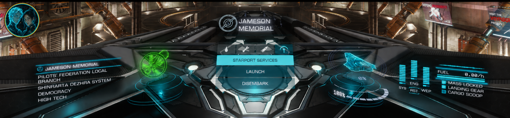

# AURA Master HUD for EDHM

A collection of 43 original AURA interface themes adapted for Elite Dangerous
using EDHM UI's supported theme format.

Each theme uses its AURA counterpart's complete palette rather than a single-colour
wash: primary and companion accents distinguish HUD structures, safe/friendly states
remain recognizable, warnings retain critical colours, and highlighted text uses a
dedicated contrast colour.

Created by **Nova_R & G_Wiz**.

## Screenshots

See the [in-game gallery](GALLERY.md) for cockpit, station-service, and EDHM UI
examples from seven contrasting themes.

## Installation

1. Install and configure [EDHM UI](https://github.com/BlueMystical/EDHM_UI).
2. Download the desired AURA theme ZIP from this repository's latest release.
3. Import the ZIP through EDHM UI.
4. Select the imported theme and choose **Apply Theme**.
5. Restart Elite Dangerous when requested by EDHM UI.

Do not manually extract these packages into the Elite Dangerous installation.
If a revised theme or preview remains cached, remove the older same-named theme
through EDHM UI, restart EDHM UI, and import the new ZIP again.

See [INSTALLATION.md](INSTALLATION.md) for expanded instructions and
[VERIFYING-DOWNLOADS.md](VERIFYING-DOWNLOADS.md) for checksum verification.
For common fixes, see [Troubleshooting](TROUBLESHOOTING.md). Theme-specific reports
and EDHM support requests are routed in [Support](SUPPORT.md).

## What this project changes

The packages contain EDHM theme settings, generated previews, and an original 3×3
HUD colour matrix. They do not automate controls, inject their own executable code,
attach to the game process, or independently modify game files. Import and activation
are performed by EDHM UI.

## Compatibility

Built from the EDHM Odyssey theme schema and intended for the live Odyssey client.
Game or EDHM updates may require a refreshed build. Keep EDHM UI itself up to date
and report theme-specific visual issues through this repository.

## Attribution

AURA Master HUD themes and preview branding: Nova_R & G_Wiz. Elite Dangerous is a
trademark of Frontier Developments plc. EDHM UI is a separate community project;
this repository is not affiliated with or endorsed by Frontier Developments or the
EDHM team.

For AURA theme colour, contrast, preview, or packaging problems, open an issue in
this repository. For EDHM installation or application problems, use EDHM's official
support channels.
